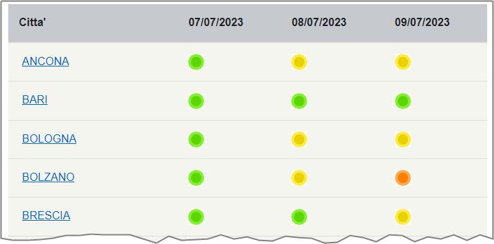

# Cosa è questo repo

Questo repo è stato creato per estrarre e archiviare i dati sui "[Bollettini sulle ondate di calore](https://www.salute.gov.it/portale/caldo/bollettiniCaldo.jsp?lingua=italiano&id=4542&area=emergenzaCaldo&menu=vuoto&btnBollettino=BOLLETTINI)", pubblicati dal Ministero della Salute.

> Per comunicare i possibili effetti sulla salute delle ondate di calore il ministero elabora dei bollettini giornalieri per 27 città con previsioni a 24, 48 e 72 ore.

## I dati sui bollettini

Sono pubblicati in una tabella HTML, in cui una colonna contiene i nomi delle città, e le altre il riferimento alla data e al livello di rischio.

Quattro [livelli di rischio](https://www.salute.gov.it/portale/caldo/dettaglioContenutiCaldo.jsp?lingua=italiano&id=2506&area=emergenzaCaldo&menu=vuoto):

- **Livello 0**, rappresenta condizioni meteorologiche che non comportano un rischio per la salute della popolazione.
- **Livello 1**, indica condizioni meteorologiche che possono precedere il verificarsi di un’ondata di calore.
- **Livello 2**, indica condizioni meteorologiche che possono rappresentare un rischio per la salute, in particolare nei sottogruppi di popolazione più suscettibili.
- **Livello 3**, indica condizioni di emergenza (ondata di calore) con possibili effetti negativi sulla salute di persone sane e attive e non solo sui sottogruppi a rischio come gli anziani, i bambini molto piccoli e le persone affette da malattie croniche.
