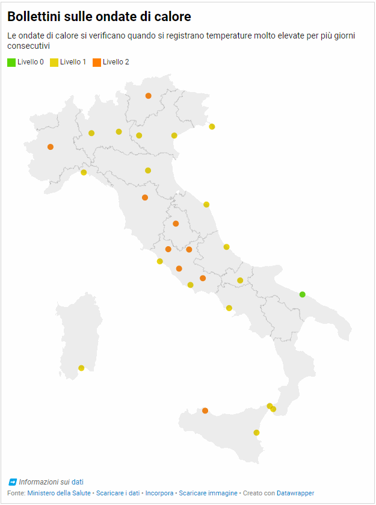

# Cosa è questo repo <!-- omit in toc -->

Questo repo è stato creato per estrarre e archiviare i dati sui "[Bollettini sulle ondate di calore](https://www.salute.gov.it/portale/caldo/bollettiniCaldo.jsp?lingua=italiano&id=4542&area=emergenzaCaldo&menu=vuoto&btnBollettino=BOLLETTINI)", pubblicati dal Ministero della Salute.

> Per comunicare i possibili effetti sulla salute delle ondate di calore il ministero elabora dei bollettini giornalieri per 27 città con previsioni a 24, 48 e 72 ore.

- [I dati sui bollettini](#i-dati-sui-bollettini)
- [I dati estratti](#i-dati-estratti)
- [Note](#note)
- [Mappa](#mappa)
- [Estrazione dati](#estrazione-dati)

## I dati sui bollettini

Sono pubblicati in una tabella HTML, in cui una colonna contiene i nomi delle città, e le altre il riferimento alla data e al livello di rischio.

[](https://www.salute.gov.it/portale/caldo/bollettiniCaldo.jsp?lingua=italiano&id=4542&area=emergenzaCaldo&menu=vuoto&btnBollettino=BOLLETTINI)

Quattro [livelli di rischio](https://www.salute.gov.it/portale/caldo/dettaglioContenutiCaldo.jsp?lingua=italiano&id=2506&area=emergenzaCaldo&menu=vuoto):

- **Livello 0**, condizioni meteorologiche che non comportano rischi per la salute della popolazione.
- **Livello 1**, pre-allerta. Condizioni meteorologiche che possono precedere il verificarsi di un'ondata di calore.
- **Livello 2**, temperature elevate e condizioni meteorologiche che possono avere effetti negativi sulla salute della popolazione, in particolare nei sottogruppi di popolazione suscettibili.
- **Livello 3**, ondata di calore. Condizioni ad elevato rischio che persistono per 3 o più giorni consecutivi.

## I dati estratti

I dati sono (al momento) **estratti ogni 4 ore** e pubblicati nella cartella [`data`](data).

Due file resi disponibili:

- [`ondate-calore_latest.csv`](data/ondate-calore_latest.csv), con gli ultimi dati estratti;
- [`ondate-calore_archivio.csv`](data/ondate-calore_archivio.csv), con l'archivio dei dati estratti, a partire da giorno 8 luglio 2023.

Sei **libero** di **usare** questi **dati** nel modo che preferisci, avendo cura di **citare** la **fonte**: la **licenza** scelta è la [`CC-BY-4.0`](https://creativecommons.org/licenses/by/4.0/deed.it) (Creative Commons Attribution 4.0 International).<br>
A titolo d'esempio, è sufficiente indicare "[dati a cura dell'Associazione onData](https://github.com/ondata/ondate-calore)" (inserendo anche il link a [`https://github.com/ondata/ondate-calore`](https://github.com/ondata/ondate-calore)).

La struttura dei dati è stata cambiata da `wide` a `long`, e le colonne con le date, sono diventata una sola colonna. Inoltre è stata aggiunta la colonna `data_estrazione` che riporta la data di estrazione.<br>
Sono in formato `CSV`, il separatore dei campi è la `,` e la codifica dei caratteri è `UTF-8`.

Sotto qualche riga di esempio:

| citta | data | livello | data_estrazione |
| --- | --- | --- | --- |
| ANCONA | 2023-07-09 | Livello1 | 2023-07-08 |
| BARI | 2023-07-09 | Livello0 | 2023-07-08 |
| BOLOGNA | 2023-07-09 | Livello1 | 2023-07-08 |
| BOLZANO | 2023-07-09 | Livello2 | 2023-07-08 |
| BRESCIA | 2023-07-09 | Livello1 | 2023-07-08 |
| CAGLIARI | 2023-07-09 | Livello1 | 2023-07-08 |
| CAMPOBASSO | 2023-07-09 | Livello1 | 2023-07-08 |
| CATANIA | 2023-07-09 | Livello1 | 2023-07-08 |
| CIVITAVECCHIA | 2023-07-09 | Livello1 | 2023-07-08 |
| FIRENZE | 2023-07-09 | Livello2 | 2023-07-08 |

Questa la descrizione dei campi:

| campo | descrizione | tipo |
|---|---|---|
| `citta` | il nome della città | testo |
| `data` | la data riportata nel bollettino | data in formato anno, mese giorno, AAAA-MM-GG |
| `livello` | il livello di rischio per quella città in quel giorno | testo |
| `data_estrazione` | la data in cui i dati sono stati estratti | data in formato anno, mese giorno, AAAA-MM-GG |

Oltre i due file estratti, è reso disponibile un file di "anagrafica" denominato [`citta-anagrafica.csv`](data/citta-anagrafica.csv): contiene le coordinate di ogni città, e il codice Istat comunale nel campo `admin3code` (la fonte dati è [geonames](https://www.geonames.org/export/)).

## Note

Nel [sito](https://www.salute.gov.it/portale/caldo/bollettiniCaldo.jsp?lingua=italiano&id=4542&area=emergenzaCaldo&menu=vuoto&btnBollettino=BOLLETTINI) dei bollettini si fa presente che:

- Per Bologna consultare il bollettino emesso a cura dell'ARPA Emilia-Romagna (<http://www.arpa.emr.it/sim/external/pciv/bollettino_calore_pciv.php>)
- Per Torino consultare il bollettino emesso a cura dell'ARPA Piemonte (<http://www.arpa.piemonte.it/bollettini/bollettino_calore_comune_torino.pdf/at_download/file>)

## Mappa

Su datawrapper è stata pubblicata [questa mappa](https://www.datawrapper.de/_/elo50/), a partire dai dati estratti dal ministero.

Se la vuoi incorporare nel tuo sito, puoi copiare il codice `HTML` di sotto.

```html
<iframe title="Bollettini sulle ondate di calore" aria-label="Mappa" id="datawrapper-chart-elo50" src="https://datawrapper.dwcdn.net/elo50/8/" scrolling="no" frameborder="0" style="width: 0; min-width: 100% !important; border: none;" height="812" data-external="1"></iframe><script type="text/javascript">!function(){"use strict";window.addEventListener("message",(function(a){if(void 0!==a.data["datawrapper-height"]){var e=document.querySelectorAll("iframe");for(var t in a.data["datawrapper-height"])for(var r=0;r<e.length;r++)if(e[r].contentWindow===a.source){var i=a.data["datawrapper-height"][t]+"px";e[r].style.height=i}}}))}();
</script>
```

[](https://www.datawrapper.de/_/elo50/)

## Estrazione dati

I dati sono estratti dalla pagina web del Ministero, con questo [script `bash`](ondate-calore.sh).
